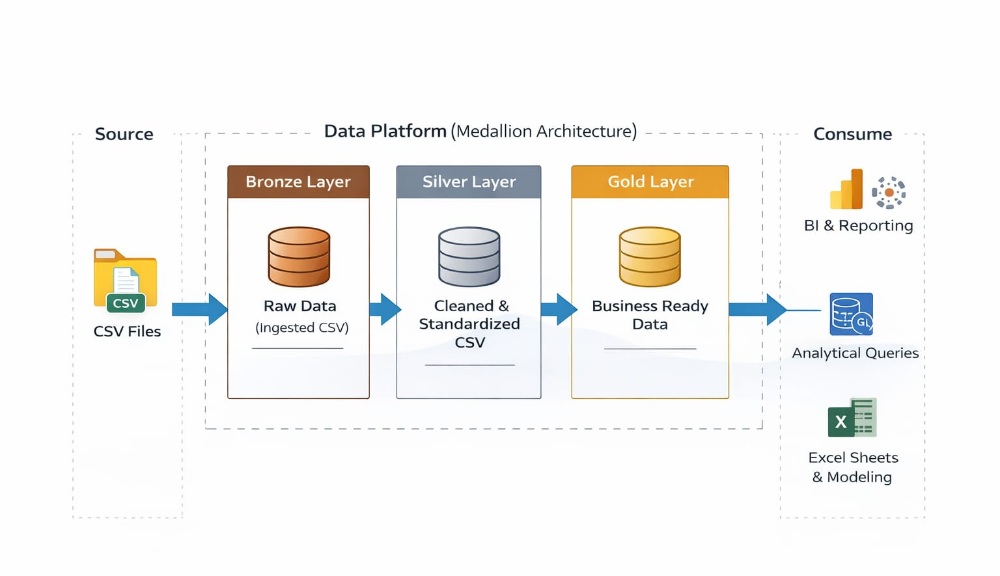

<div align="center">


<br/>

# 🛒 Retail Supply Chain Analytics Platform

### End-to-End Data Engineering & Business Intelligence on 100K+ Real E-Commerce Orders

<br/>

[](https://www.microsoft.com/sql-server)
[](https://powerbi.microsoft.com)
[](https://microsoft.com/excel)
[](https://databricks.com/glossary/medallion-architecture)
[](https://www.kaggle.com/datasets/olistbr/brazilian-ecommerce)

<br/>

> **Built a production-grade data warehouse from scratch** — raw CSV ingestion through a 3-layer Medallion pipeline to an executive Power BI dashboard — using the same architectural patterns deployed at scale by modern data teams worldwide.

</div>

\## 📌 What This Project Is


This is a \*\*complete, end-to-end retail analytics platform\*\* built on the \[Olist Brazilian E-Commerce Dataset](https://www.kaggle.com/datasets/olistbr/brazilian-ecommerce) — real transaction data from Brazil's largest marketplace covering \*\*2 years, 99,000+ orders, and R$15.8 million in revenue\*\*.


The project goes far beyond a simple dashboard. It implements \*\*Medallion Architecture\*\* (the industry standard for modern data platforms), writes \*\*advanced T-SQL\*\* that a senior analyst would be proud of, delivers \*\*4 interconnected Excel business models\*\*, and produces a \*\*3-page Power BI dashboard\*\* with time intelligence, drill-through, and waterfall analysis.


Every design decision — from grain selection to fan-out prevention to dynamic date variables — is documented and justified.


\---


\## 📊 The Dataset at a Glance


| Table | Description | Rows |

|---|---|---|

| `olist\_orders\_dataset.csv` | Order status, timestamps, customer link | \*\*99,441\*\* |

| `olist\_order\_items\_dataset.csv` | Products per order — price, freight | \*\*112,650\*\* |

| `olist\_order\_payments\_dataset.csv` | Payment method and value | \*\*103,886\*\* |

| `olist\_order\_reviews\_dataset.csv` | Customer review scores and text | \*\*99,224\*\* |

| `olist\_customers\_dataset.csv` | Customer IDs and location | \*\*99,441\*\* |

| `olist\_products\_dataset.csv` | Product dimensions and category | \*\*32,951\*\* |

| `olist\_sellers\_dataset.csv` | Seller location | \*\*3,095\*\* |

| `olist\_geolocation\_dataset.csv` | ZIP code lat/lng coordinates | \*\*1,000,163+\*\* |

| `product\_category\_name\_translation.csv` | Portuguese → English categories | \*\*71\*\* |


\*\*Date range:\*\* September 2016 → October 2018  \&nbsp;|\&nbsp; \*\*Source:\*\* \[Kaggle — Olist Brazilian E-Commerce](https://www.kaggle.com/datasets/olistbr/brazilian-ecommerce)


\---


\## 🏗️ Architecture — Medallion Pipeline


```

┌────────────────────────────────────────────────────────────────────────┐

│                         RAW DATA SOURCE                                │

│              9 CSV files from Kaggle  ·  \~1.5M total rows              │

└──────────────────────────────┬─────────────────────────────────────────┘

&#x20;                              │  Import Flat File Wizard (SSMS)

&#x20;                              ▼

┌────────────────────────────────────────────────────────────────────────┐

│  🥉  BRONZE LAYER  ·  bronze.stg\_\*  ·  9 tables                       │

│                                                                        │

│  Raw staging — all columns nvarchar(200), no constraints, no joins.   │

│  1-to-1 mirror of every CSV file. Audit columns: load\_ts + src\_file.  │

└──────────────────────────────┬─────────────────────────────────────────┘

&#x20;                              │  T-SQL cleaning scripts

&#x20;                              ▼

┌────────────────────────────────────────────────────────────────────────┐

│  🥈  SILVER LAYER  ·  silver.slv\_\*  ·  8 tables                       │

│                                                                        │

│  Cleaned \& standardised — ROW\_NUMBER() dedup, TRY\_CAST type casting,  │

│  NULL imputation, category translation (PT→EN), PKs, FKs, CHECK       │

│  constraints. 610 null categories → 'uncategorized'. 547 duplicate    │

│  reviews deduped by review\_id (not order\_id — orders have multi).     │

└──────────────────────────────┬─────────────────────────────────────────┘

&#x20;                              │  Star schema construction

&#x20;                              ▼

┌────────────────────────────────────────────────────────────────────────┐

│  🥇  GOLD LAYER  ·  gold.\*  ·  13 objects                              │

│                                                                        │

│  dim\_customer  dim\_product  dim\_seller  dim\_date  dim\_geolocation     │

│  fact\_orders  fact\_order\_items  fact\_payments  fact\_reviews            │

│  + clustered indexes + composite indexes + CHECK constraints           │

└────────────┬───────────────────────────┬───────────────────────────────┘

&#x20;            │                           │

&#x20;            ▼                           ▼

┌────────────────────┐     ┌─────────────────────────────────────────┐

│  📊  EXCEL         │     │  📈  POWER BI                            │

│  4 business models │     │  3-page executive dashboard              │

│  via Power Query   │     │  Star schema · 25 DAX measures          │

│  One-click refresh │     │  Time intelligence · Drill-through      │

└────────────────────┘     └─────────────────────────────────────────┘

```




\---


\## 🔢 Real Business Metrics — What the Data Says


<div align="center">


| Metric | Value | Insight |

|:---|:---:|:---|

| 💰 \*\*Total Revenue\*\* | \*\*R$ 15,843,553\*\* | Across 24 months of trading |

| 📦 \*\*Total Orders\*\* | \*\*99,441\*\* | \~4,143 orders per month average |

| 🛍️ \*\*Items Sold\*\* | \*\*112,650\*\* | 1.13 items per order on average |

| 👥 \*\*Unique Customers\*\* | \*\*99,441\*\* | Near 1:1 — very low repeat rate |

| 🏪 \*\*Active Sellers\*\* | \*\*3,095\*\* | Distributed across 27 Brazilian states |

| 📂 \*\*Product Categories\*\* | \*\*73\*\* | After Portuguese → English translation |

| ✅ \*\*On-Time Delivery\*\* | \*\*91.9%\*\* | 88,644 of 96,478 delivered orders |

| ⏰ \*\*Late Deliveries\*\* | \*\*8.1%\*\* | 7,826 orders — avg delay: \~10 days |

| ⚠️ \*\*Revenue at Risk\*\* | \*\*R$ 1,351,625\*\* | From late deliveries alone |

| ⭐ \*\*Avg Review Score\*\* | \*\*4.09 / 5.0\*\* | Customers generally satisfied |

| 💳 \*\*Top Payment\*\* | \*\*77.2% credit card\*\* | 76,795 out of 99,441 orders |

| 🚚 \*\*Avg Freight\*\* | \*\*16.6% of price\*\* | R$19.99 per item on R$120.65 avg |


</div>


\---


\## 🗄️ SQL — What Was Built


\### Phase 1–3: Data Pipeline (Bronze → Silver → Gold)


```sql

\-- 📌 Example: Silver deduplication using ROW\_NUMBER()

\-- Why NOT DISTINCT: DISTINCT hides data problems. ROW\_NUMBER() is explicit.

WITH deduped\_customers AS (

&#x20;   SELECT \*,

&#x20;       ROW\_NUMBER() OVER (

&#x20;           PARTITION BY customer\_unique\_id

&#x20;           ORDER BY customer\_unique\_id DESC

&#x20;       ) AS rn

&#x20;   FROM bronze.stg\_customers

&#x20;   WHERE customer\_id IS NOT NULL AND TRIM(customer\_id) <> ''

)

INSERT INTO silver.slv\_customers

SELECT customer\_id, customer\_unique\_id, customer\_zip\_code\_prefix, customer\_city, customer\_state

FROM deduped\_customers

WHERE rn = 1;

```


```sql

\-- 📌 Example: Gold geolocation using AVG centroid (not ROW\_NUMBER)

\-- Why AVG: each zip code appears 3–10 times with slightly different coords.

\-- AVG gives the centroid of the zip area — more accurate than one arbitrary row.

SELECT

&#x20;   TRIM(geolocation\_zip\_code\_prefix)   AS zip\_code\_prefix,

&#x20;   ROUND(AVG(geolocation\_lat), 6)      AS latitude,

&#x20;   ROUND(AVG(geolocation\_lng), 6)      AS longitude,

&#x20;   MAX(geolocation\_city)               AS city,

&#x20;   MAX(geolocation\_state)              AS state

INTO gold.dim\_geolocation

FROM silver.slv\_geolocation

GROUP BY TRIM(geolocation\_zip\_code\_prefix);

```


\### Phase 4: Analytical Queries — 6 Production Queries


| # | Query | Key Technique | Business Value |

|---|---|---|---|

| 1 | \*\*Revenue Leakage Detection\*\* | `CASE`, `NULLIF`, freight-to-price ratio | Finds categories where freight eats the margin |

| 2 | \*\*RFM Customer Segmentation\*\* | `NTILE(5)`, `@rfm\_end = MAX(date)` | Champions vs At-Risk vs Lost customers |

| 3 | \*\*Seller Reliability Scoring\*\* | CTE pattern, `RANK()`, tiered CASE | Tier 1–4 seller classification |

| 4 | \*\*Month-over-Month Growth\*\* | `LAG()` window function | Revenue trend with prior-period comparison |

| 5 | \*\*Dead Inventory Detection\*\* | `@dataset\_end`, `DATEDIFF`, CASE | Dead / Slow Moving / Active / Never Sold |

| 6 | \*\*Monthly Executive Report\*\* | `CREATE PROCEDURE`, `SET NOCOUNT ON` | Parameterised stored procedure for any month |


```sql

\-- 📌 Example: RFM Segmentation — why @rfm\_end not GETDATE()

\-- Dataset ends 2018-10-17. GETDATE() in 2026 = 2,700+ day recency for ALL customers.

\-- That collapses every NTILE band into the same score — RFM becomes meaningless.

DECLARE @rfm\_end DATE = (SELECT MAX(order\_purchase\_date) FROM gold.vw\_master\_orders);


WITH rfm\_base AS (

&#x20;   SELECT

&#x20;       customer\_id,

&#x20;       DATEDIFF(DAY, MAX(order\_purchase\_date), @rfm\_end) AS recency,

&#x20;       COUNT(DISTINCT order\_id)                          AS frequency,

&#x20;       ROUND(SUM(total\_item\_value), 2)                   AS monetary

&#x20;   FROM gold.vw\_master\_orders

&#x20;   WHERE order\_status = 'delivered'

&#x20;   GROUP BY customer\_id

)

SELECT \*,

&#x20;   NTILE(5) OVER (ORDER BY recency   ASC)  AS r\_score,  -- lower days = more recent = better

&#x20;   NTILE(5) OVER (ORDER BY frequency DESC) AS f\_score,

&#x20;   NTILE(5) OVER (ORDER BY monetary  DESC) AS m\_score

FROM rfm\_base;

```


\---


\## 🔍 EDA — Exploratory Data Analysis (9 Scripts)


Run on `gold.vw\_master\_orders` after the pipeline is complete. Every number below was verified from the actual CSV.


| Script | What It Finds |

|---|---|

| \*\*1.1 Dataset Health Report\*\* | Row counts, NULL rates, duplicate detection across all Gold tables |

| \*\*1.2 Date Range Check\*\* | Confirms 2016-09-04 → 2018-10-17 trading window |

| \*\*2.1 Price Distribution\*\* | P25/P50/P75/P95, coefficient of variation, mean vs median |

| \*\*2.2 Review \& Delay Distribution\*\* | Score frequency, ASCII bar chart in SSMS, delay buckets |

| \*\*3.1 Freight vs Review Score\*\* | Does high freight → lower reviews? (bivariate) |

| \*\*3.2 Category \& Geographic Analysis\*\* | Worst freight-to-price categories, revenue by state |

| \*\*4.1 Temporal Patterns\*\* | When do customers shop? Weekday vs weekend, peak months |

| \*\*5.1 Z-Score Outlier Detection\*\* | Products priced 2σ above mean — data errors vs genuine outliers |

| \*\*5.2 IQR Outlier Detection on Freight\*\* | Robust outlier method for skewed freight distribution |


\*\*Key EDA findings from the actual data:\*\*

\- \*\*SP (São Paulo) dominates\*\*: 41,746 customers (42% of all orders) — the rest spread across 26 states

\- \*\*Credit card rules\*\*: 77.2% of payments by credit card; boleto at 19.9%

\- \*\*Freight is significant\*\*: Average 16.6% of item price — a meaningful cost driver

\- \*\*97% delivered\*\*: Only 625 canceled orders out of 99,441 total

\- \*\*Review scores skew positive\*\*: Mean 4.09/5 — customers are generally happy, making low-review orders particularly significant signals


\---


\## 📈 Advanced Analytics (5 Scripts)


| Script | Technique | Output |

|---|---|---|

| \*\*A1 — Pareto by Product\*\* | Cumulative `SUM() OVER()` | Which 20% of products drive 80% of revenue |

| \*\*A2 — Pareto by Category\*\* | Same technique, category grain | Executive-level revenue concentration view |

| \*\*A3 — Customer Cohort Retention\*\* | `DATEFROMPARTS()`, self-join, retention % | Month 0 cohort size → Month 6 retention rate |

| \*\*A4 — Rolling Averages\*\* | `ROWS BETWEEN 6 PRECEDING AND CURRENT ROW` | 7-day and 30-day smoothed revenue + cumulative total |

| \*\*A5 — Z-Score per Category\*\* | Two-CTE pattern, per-group standardisation | Context-aware outlier detection within each category |


```sql

\-- 📌 Example: Pareto — cumulative SUM window function

WITH product\_revenue AS (

&#x20;   SELECT

&#x20;       product\_id, category,

&#x20;       ROUND(SUM(total\_item\_value), 2) AS product\_revenue,

&#x20;       COUNT(DISTINCT order\_id)        AS total\_orders

&#x20;   FROM gold.vw\_master\_orders

&#x20;   WHERE order\_status = 'delivered'

&#x20;   GROUP BY product\_id, category

),

pareto AS (

&#x20;   SELECT \*,

&#x20;       ROUND(SUM(product\_revenue) OVER (

&#x20;           ORDER BY product\_revenue DESC

&#x20;           ROWS BETWEEN UNBOUNDED PRECEDING AND CURRENT ROW

&#x20;       ) / SUM(product\_revenue) OVER () \* 100, 2) AS cumulative\_pct

&#x20;   FROM product\_revenue

)

SELECT \*, CASE WHEN cumulative\_pct <= 80 THEN 'Revenue Driver' ELSE 'Long Tail' END AS pareto\_segment

FROM pareto

ORDER BY product\_revenue DESC;

```


\---


\## 📊 Excel — 4 Business Models


All sheets connect to `gold.vw\_master\_orders` via \*\*Power Query\*\* — one-click refresh, no manual paste.


| Sheet | Business Question | Key Excel Technique |

|---|---|---|

| \*\*Seller\_Scorecard\*\* | Which sellers are failing? | CTE SQL + weighted score formula + Red-Yellow-Green heatmap |

| \*\*Pricing\_Simulator\*\* | What if freight % changes? | What-If Data Table (most impressive interview technique) |

| \*\*Inventory\_Model\*\* | Which products are dead stock? | `@dataset\_end` dynamic variable + `SUMIF` summaries |

| \*\*Revenue\_PL\*\* | Revenue by category and state? | PivotTable + sparklines + margin % + slicers |


The \*\*What-If Data Table\*\* in Sheet 2 shows Monthly Net Revenue at every combination of freight % and return rate — a two-dimensional sensitivity analysis that proves business thinking, not just data skills.


\---


\## 📈 Power BI — 3-Page Executive Dashboard


\*\*Star schema model\*\* — 4 fact tables + 4 dimension tables. No view. All transformation done in SQL; Power BI is purely for presentation.

&#x20;


\### Page 1 — Executive Summary


> \*"How is the business performing overall?"\*


KPI cards (Revenue · Orders · On-Time % · Avg Review · Revenue at Risk) · Monthly Revenue Trend with YoY comparison line · Top 10 Categories bar · Payment Type donut · MTD/QTD cards · Slicers


\### Page 2 — Supply Chain Monitor


> \*"Where are the delivery problems and who is causing them?"\*


Seller Reliability gauge · Avg Delay by Category · \*\*Geographic bubble map\*\* (lat/lng coordinates — not filled map) · Bottom 15 Sellers table · Late delivery KPIs


\### Page 3 — Revenue Leakage


> \*"How much money are we losing and why?"\*


\*\*Waterfall chart\*\* (Gross Revenue → Freight Cost → Est. Returns → Net Revenue) · Freight % vs Review Score scatter · Top 20 At-Risk Products · Freight Overrun Risk + Refund Risk alert cards


\### DAX Highlights


```dax

// Fan-out safe revenue — fact\_order\_items grain

Total Revenue = SUM(gold\_fact\_order\_items\[total\_item\_value])


// Grain-safe order count — DISTINCTCOUNT not COUNTROWS

Total Orders = DISTINCTCOUNT(gold\_fact\_orders\[order\_id])


// On-Time % — item-grain safe

On Time % =

DIVIDE(

&#x20;   CALCULATE(

&#x20;       DISTINCTCOUNT(gold\_fact\_orders\[order\_id]),

&#x20;       gold\_fact\_orders\[delivery\_status] = "On Time"

&#x20;   ),

&#x20;   \[Total Orders]

) \* 100


// Year-over-year comparison

Revenue LY = CALCULATE(\[Total Revenue], SAMEPERIODLASTYEAR(gold.dim\_date\[date\_id]))

YoY Growth % = DIVIDE(\[Total Revenue] - \[Revenue LY], \[Revenue LY]) \* 100


// Waterfall — DATATABLE + SWITCH (correct method, not What-If parameters)

WaterfallSteps = DATATABLE("Step", STRING,

&#x20;   {{"1. Gross Revenue"}, {"2. Freight Cost"}, {"3. Est Returns"}, {"4. Net Revenue"}})


Waterfall Value =

SWITCH(SELECTEDVALUE(WaterfallSteps\[Step]),

&#x20;   "1. Gross Revenue",  \[Gross Revenue],

&#x20;   "2. Freight Cost",   \[Total Freight Cost] \* -1,

&#x20;   "3. Est Returns",    \[Refund Risk] \* -1,

&#x20;   "4. Net Revenue",    \[Net Revenue],

&#x20;   BLANK())

```


\---


\## 🧠 Key Engineering Decisions


These are the questions an interviewer will ask. Here are the answers.


\*\*Why `total\_item\_value` and not `payment\_value` for revenue?\*\*

`fact\_order\_items` is at item grain — one row per product per order. `payment\_value` is at order grain and would be duplicated across all items in that order, inflating revenue by the item count. `total\_item\_value = price + freight\_value` is calculated at item level and is grain-safe.


\*\*Why `PARTITION BY review\_id` not `order\_id` in review deduplication?\*\*

547 orders have multiple \*legitimate\* reviews. Deduplicating by `order\_id` silently drops valid customer feedback. Deduplicating by `review\_id` removes only true ingestion duplicates of the same review.


\*\*Why `@rfm\_end = MAX(order\_purchase\_date)` not `GETDATE()` in RFM?\*\*

This dataset ends October 2018. Running in 2026, `GETDATE()` gives every single customer a recency of 2,700+ days — all five NTILE bands collapse to the same range and RFM becomes meaningless. Dynamic max date makes the query portable to any dataset.


\*\*Why `AVG(lat/lng)` for geolocation instead of `ROW\_NUMBER()`?\*\*

Each ZIP code appears 3–10 times in the source data with slightly different coordinates (GPS measurement variance). `AVG` gives the geographic centroid — the most representative point for the area. `ROW\_NUMBER()` would pick one arbitrary row.


\*\*Why separate `DECLARE @dataset\_end` in dead inventory?\*\*

The query runs on historical data. Hardcoding `'2018-12-31'` would break on live pipelines. The variable reads `MAX(order\_purchase\_date)` dynamically — it works correctly on both the static Olist dataset and any live e-commerce feed.


\---


\## 🚀 Getting Started


\### Prerequisites

\- \*\*SQL Server 2017+\*\* with SSMS

\- \*\*Power BI Desktop\*\* (free download)

\- \*\*Microsoft Excel\*\* with Power Query


\### Setup


```bash

\# 1. Download dataset

\#    https://www.kaggle.com/datasets/olistbr/brazilian-ecommerce

\#    Extract all CSVs → OlistProject/01\_raw\_data/


\# 2. Create database in SSMS

CREATE DATABASE RetailAnalytics;

USE RetailAnalytics;

EXEC('CREATE SCHEMA bronze');

EXEC('CREATE SCHEMA silver');

EXEC('CREATE SCHEMA gold');


\# 3. Import Flat File Wizard (SSMS)

\#    Right-click RetailAnalytics → Tasks → Import Flat File

\#    Load all 9 CSVs → set ALL columns to nvarchar(200) → name each stg\_\*

\#    Then: ALTER SCHEMA bronze TRANSFER dbo.stg\_customers; (×9)


\# 4. Run Silver scripts

\#    02\_silver\_tables.sql → 03\_silver\_load\_clean.sql


\# 5. Run Gold scripts

\#    04\_gold\_schema.sql → 05\_master\_view.sql


\# 6. Run analytical queries → EDA → advanced analytics


\# 7. Power BI: Get Data → SQL Server → localhost/RetailAnalytics

\#    Load: fact\_orders, fact\_order\_items, fact\_payments, fact\_reviews,

\#          dim\_customer, dim\_product, dim\_seller, dim\_date


\# 8. Excel: Data → Get Data → SQL Server → gold.vw\_master\_orders

```


\---


\## 📁 Repository Structure


```

OlistProject/

│

├── 📂 01\_raw\_data/              ← 9 Kaggle CSVs (never modified)

│

├── 📂 02\_sql/

│   ├── bronze/                  ← 01\_bronze\_staging.sql

│   ├── silver/                  ← 02\_silver\_tables.sql · 03\_silver\_load\_clean.sql

│   ├── gold/                    ← 04\_gold\_schema.sql · 05\_master\_view.sql

│   ├── analytical\_queries/      ← 06\_revenue\_leakage → 11\_stored\_procedure

│   ├── eda/                     ← 12\_health\_check → 16\_outlier\_detection

│   └── advanced\_analytics/      ← 17\_pareto → 20\_zscore\_outliers

│

├── 📂 03\_excel/

│   └── retail\_business\_models.xlsx   ← 4 sheets via Power Query

│

├── 📂 04\_powerbi/

│   └── retail\_dashboard.pbix         ← 3-page dashboard

│

├── 📂 06\_diagrams/

│   ├── erd\_diagram.png               ← Entity Relationship Diagram

│   ├── architecture\_flow.png         ← Bronze→Silver→Gold pipeline

│   ├── dashboard\_1.png               ← Executive Summary

|   ├── dashboard\_2.png               ← Supply chain dashboard

|   ├── dashboard\_3.png               ← Revenue Leakage Detection

│

└── README.md

```


\---


\## 🏆 What Makes This Project Stand Out


Most student portfolios are \*\*Excel → Power BI\*\*.


This project is \*\*CSV → Bronze → Silver → Gold → Analytical Queries → EDA → Advanced Analytics → Excel → Power BI\*\* — with every layer properly engineered, documented, and justified.


\- ✅ \*\*Medallion Architecture\*\* — the pattern used by Databricks, Netflix, Airbnb

\- ✅ \*\*Data quality enforcement\*\* — PKs, FKs, CHECK constraints at Silver layer

\- ✅ \*\*Production SQL patterns\*\* — CTEs, window functions, stored procedures, dynamic variables

\- ✅ \*\*Fan-out awareness\*\* — explicit grain design at every layer

\- ✅ \*\*Business-driven analysis\*\* — RFM, Pareto, cohort retention, dead inventory

\- ✅ \*\*Interview-ready answers\*\* — every design decision is documented and justified


\---


\## 📚 Dataset Credit


Olist. \*Brazilian E-Commerce Public Dataset by Olist\*. Kaggle, 2018.  

🔗 https://www.kaggle.com/datasets/olistbr/brazilian-ecommerce  

Licensed under \[CC BY-NC-SA 4.0](https://creativecommons.org/licenses/by-nc-sa/4.0/)


\---


<div align="center">


\*Built with purpose\*


</div>

